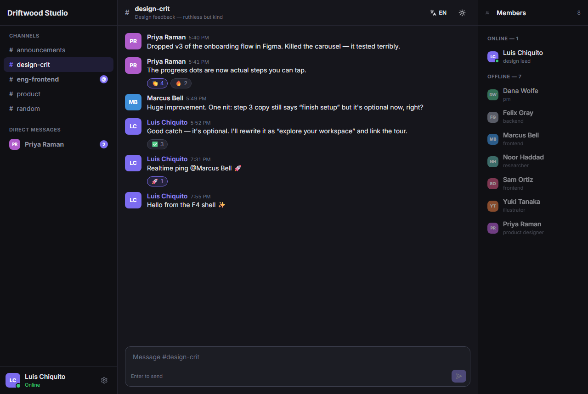
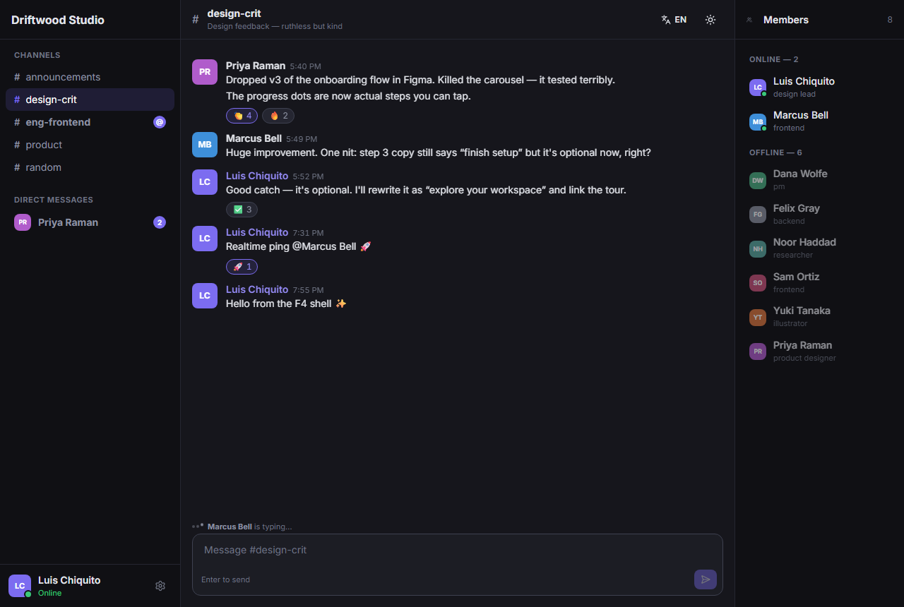
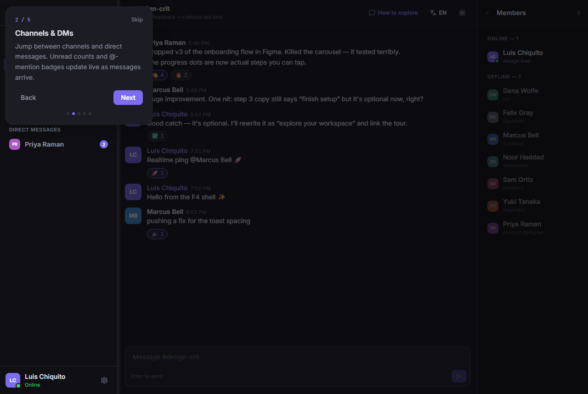
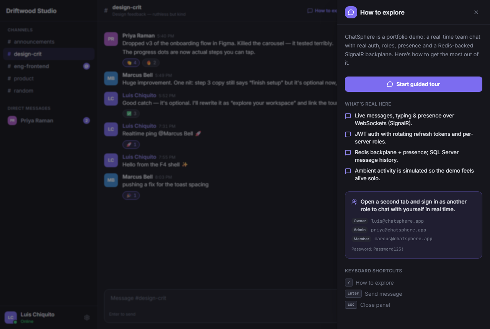

# ChatSphere — real-time team messaging

A fast, Slack/Discord-style **team chat** with channels, direct messages, presence, typing indicators and
emoji reactions — all **real-time over WebSockets** with **.NET SignalR** and a **Redis backplane**. Built
as a portfolio piece with production-grade auth, per-server roles, tests, and a guided demo layer that even
**simulates teammate activity** so the live demo feels alive for a solo visitor.

> **Status:** complete and runnable end-to-end locally. Cloud deploy is intentionally deferred (batched
> with the rest of the portfolio).

---

## Highlights

- **Real-time everything** — messages, typing, presence and reactions delivered over SignalR; clients join
  a group per channel and per server for targeted fan-out.
- **Redis backplane & presence** — presence is connection-counted in Redis (correct across instances) and
  the Redis backplane lets SignalR scale out horizontally. Falls back to in-memory when Redis is absent.
- **Channels & DMs** — public channels and direct messages unified under one model; infinite-scroll history.
- **Live UX** — message grouping by author, “typing…” indicators, emoji reactions, @-mentions, and unread
  badges that update as messages arrive.
- **Auth & roles** — JWT access + **rotating refresh tokens**, brute-force lockout, per-server RBAC
  (Owner / Admin / Member).
- **Lively guided demo** — a coach-mark tour, an “How to explore” panel, and a **server-side activity
  simulator**: seeded teammates type and post ephemeral messages so the demo breathes even solo.
- **Polish** — dark-first design, **EN/ES** i18n, responsive (mobile channel drawer), careful states.

## Screenshots

| 3-column chat (dark) | Card detail / reactions |
|---|---|
|  |  |

| Guided tour | “How to explore” panel |
|---|---|
|  |  |

## Stack

| Layer | Tech |
|---|---|
| Frontend | Angular 20 (standalone + signals), Tailwind v4, @microsoft/signalr |
| Backend | .NET 9 Web API, SignalR hubs, Clean Architecture |
| Real-time | SignalR + Redis backplane & presence (StackExchange.Redis) |
| Database | SQL Server 2022 + EF Core 9 (messages & history) |
| Auth | JWT access + rotating refresh, lockout, per-server roles |
| Testing | 25 backend unit tests (xUnit) + Playwright E2E (auth, chat, tour) |

## Run it locally

**Prerequisites:** .NET 9 SDK, Node 20+, SQL Server (local, Windows auth), Docker (for Redis).

```bash
# 1. Redis (SignalR backplane + presence)
docker compose up -d redis

# 2. Backend — creates/migrates/seeds the ChatSphere database on first run
cd backend
dotnet run --project src/ChatSphere.Api        # → http://localhost:5191  (/health)

# 3. Frontend
cd frontend
npm install
npm start                                        # → http://localhost:4200
```

Open http://localhost:4200 and sign in with a demo account. **Tip:** open a second tab and sign in as a
different role to see real-time messaging between two users — or just watch the simulated activity.

### Demo accounts

| Role | Email | Password |
|---|---|---|
| Owner | `luis@chatsphere.app` | `Password123!` |
| Admin | `priya@chatsphere.app` | `Password123!` |
| Member | `marcus@chatsphere.app` | `Password123!` |

(Every seeded account uses `Password123!`.)

## Tests

```bash
# Backend unit tests (in-memory; no SQL/Redis needed)
cd backend && dotnet test

# Frontend E2E (needs the API on :5191 and Redis; starts the web app itself)
cd frontend && npx playwright test
```

## Documentation

- [`docs/PHASES.md`](docs/PHASES.md) — phase-by-phase build log.
- [`TECHNICAL.md`](TECHNICAL.md) — architecture deep-dive (SignalR hub, Redis, presence, auth).

---

Built by **Luis Chiquito Vera** as part of a software-engineering portfolio.
